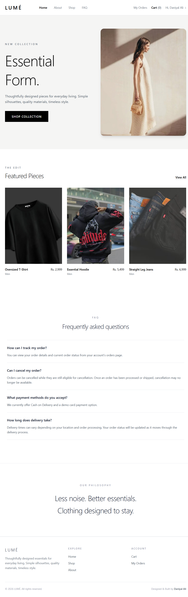
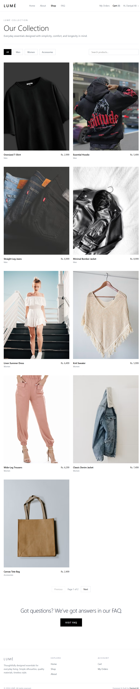
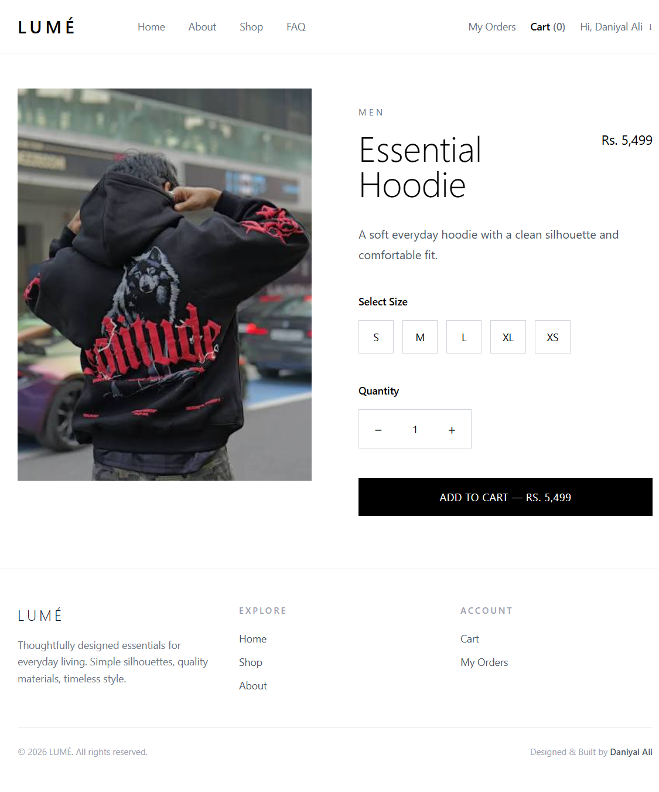
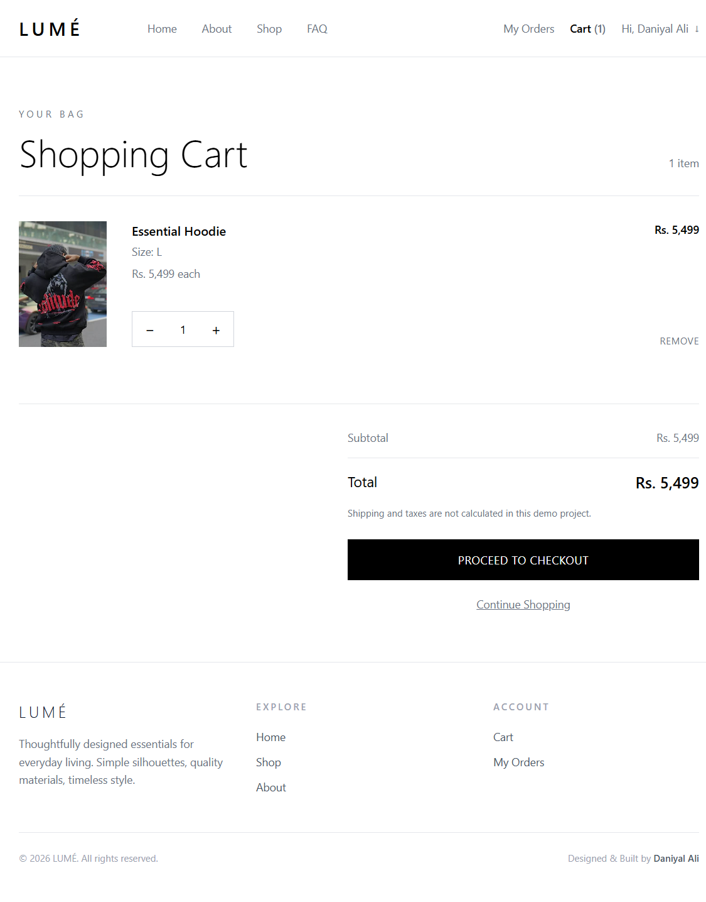
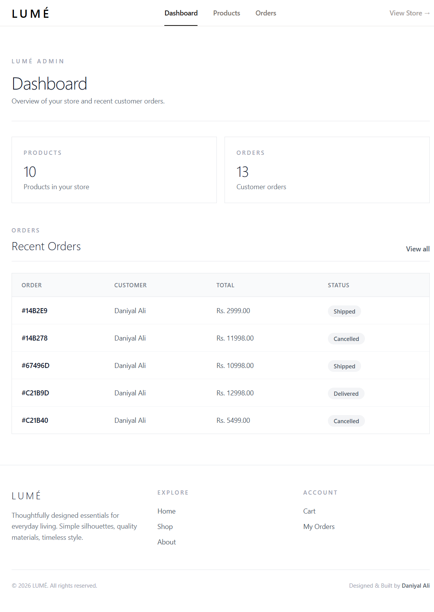
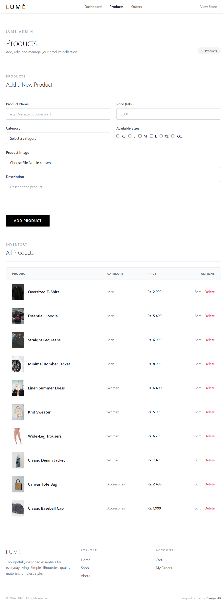
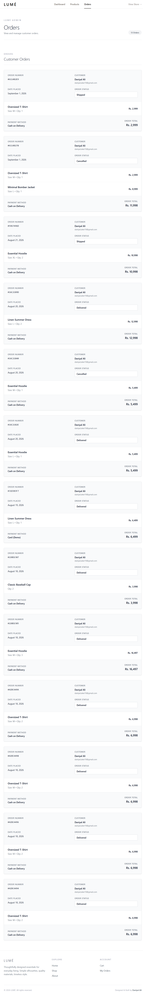
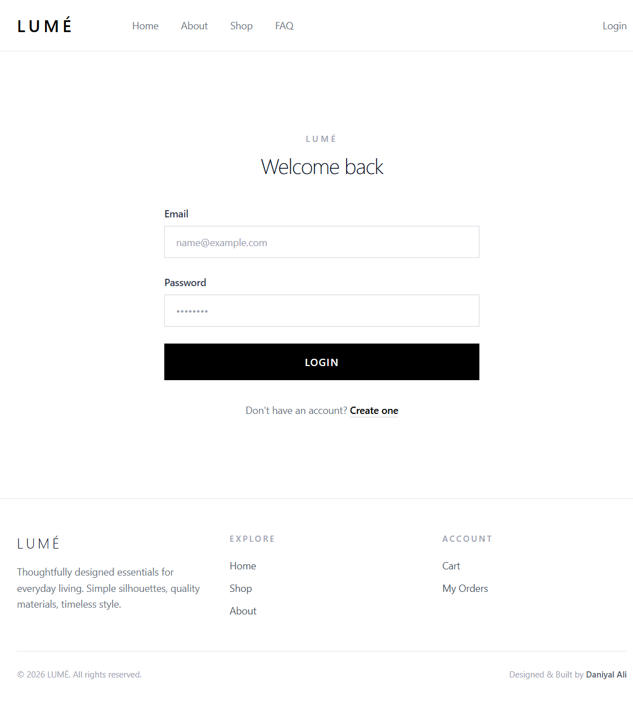
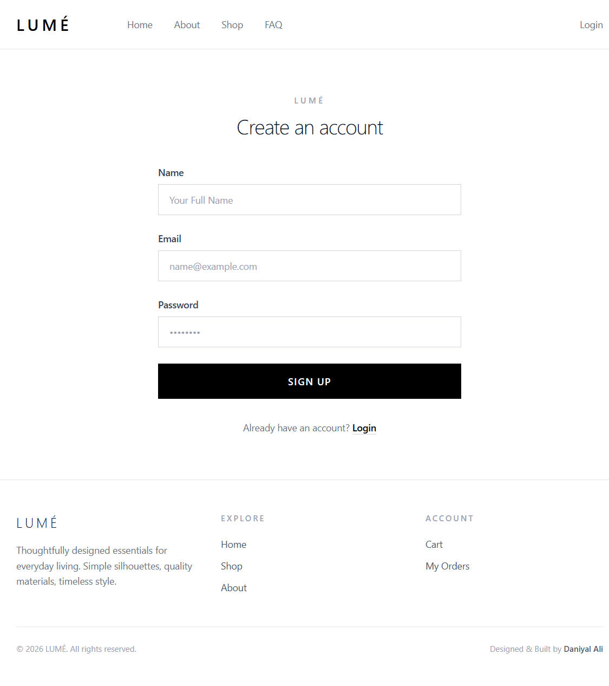

# LUMÉ — E-Commerce Web Application

A full-stack e-commerce web application built with the MERN stack, featuring authentication, product management, shopping cart, checkout, order management, and an admin dashboard.

## 🌐 Live Demo

[Visit LUMÉ](https://lume-client-bay.vercel.app/)

## 📸 Screenshots

### Home



### Products



### Product Details



### Shopping Cart



### Admin Dashboard



### Admin Product Management



### Admin Order Management



## 🔐 Client Authentication

### Login



### Registration



## 🛠️ Tech Stack

- React.js
- Node.js
- Express.js
- MongoDB
- Tailwind CSS

## ✨ Features

- User registration and login
- JWT-based authentication and authorization
- Product browsing and management
- Shopping cart
- Checkout and order management
- Order cancellation
- Admin dashboard
- Protected admin routes
- Responsive design

## 📂 Project Structure

```text
lume-ecommerce/
├── client/     # React frontend
└── server/     # Express backend

-----------------------------------------

## 🚀 Deployment
Frontend: Vercel
Backend: Vercel
Database: MongoDB Atlas


## 👨‍💻 Author

Daniyal Ali

GitHub: daniyalalee24
LinkedIn: https://www.linkedin.com/in/daniyalalee/
```
